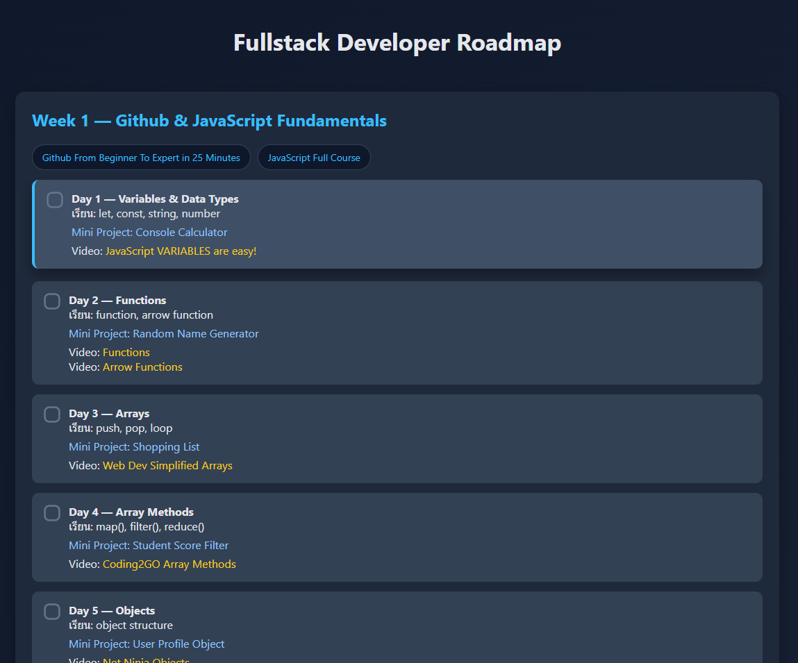
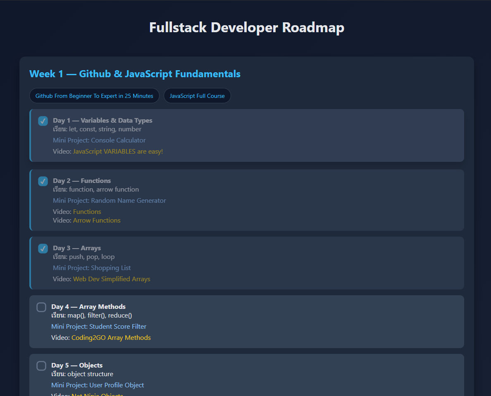
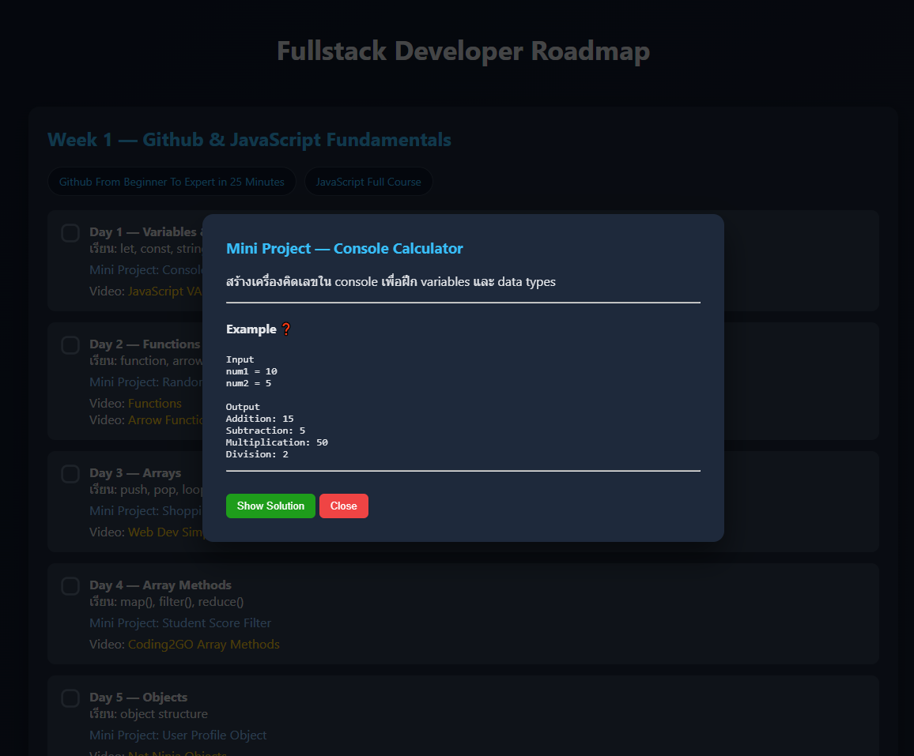
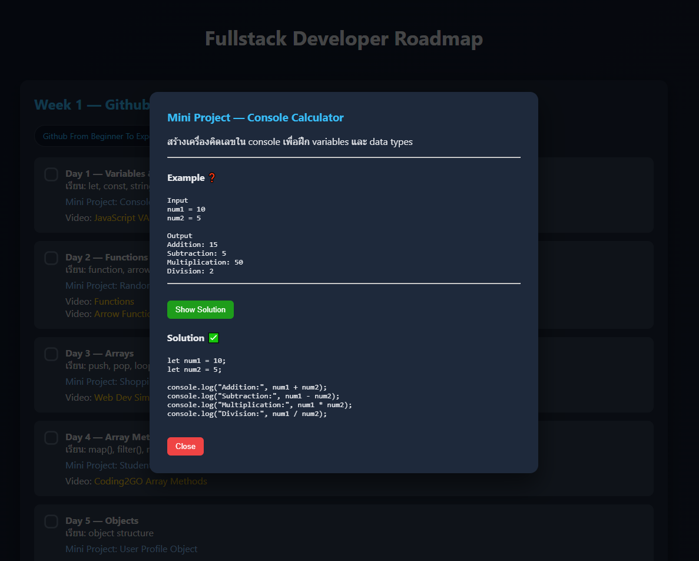

# Fullstack Developer Study Roadmap

เว็บไซต์สำหรับรวบรวม **Roadmap การเรียนรู้ Fullstack Web Development**
เพื่อช่วยจัดลำดับการเรียนรู้ และรวมแหล่งความรู้ต่าง ๆ ไว้ในที่เดียว

โปรเจคนี้ถูกสร้างขึ้นเพื่อแก้ปัญหาการเรียนเขียนโปรแกรมจากวิดีโอออนไลน์
ซึ่งมักมีเนื้อหากระจัดกระจาย และไม่มีโครงสร้างการเรียนที่ชัดเจน

---

## 📷 Preview

### หน้าเว็บไซต์หลัก



### Roadmap การเรียน



### ตัวอย่าง Mini Project



### ตัวอย่าง Solution



---

## 🎯 จุดประสงค์ของโปรเจค

โปรเจคนี้ถูกสร้างขึ้นเพื่อแก้ปัญหาที่พบระหว่างการเรียนเขียนโปรแกรมด้วยตนเอง เช่น

* วิดีโอสอนมีจำนวนมากและกระจัดกระจาย
* หาวิดีโอที่เคยดูไม่เจอ
* ไม่มีโครงสร้างการเรียนที่ชัดเจน
* ไม่รู้ว่าควรเรียนอะไรก่อนหลัง

เว็บไซต์นี้จึงช่วย

* รวมเนื้อหาการเรียนไว้ในที่เดียว
* จัดลำดับการเรียนรู้
* เพิ่มแบบฝึกหัดและ Mini Project
* ใช้เป็น Roadmap สำหรับการเรียน Fullstack Development

---

## 🚀 ฟีเจอร์ของเว็บไซต์

* Roadmap สำหรับการเรียน Fullstack Development
* รวมวิดีโอสอนในแต่ละหัวข้อ
* มี Mini Project ให้ฝึกในแต่ละช่วง
* จัดลำดับการเรียนจาก Frontend ไป Backend
* UI เรียบง่ายเพื่อให้โฟกัสกับการเรียน

---

## 🛠 เทคโนโลยีที่ใช้

### Frontend

* HTML
* CSS
* JavaScript

### Tools

* Git
* GitHub
* Visual Studio Code

---

## 📚 โครงสร้างการเรียนรู้ใน Roadmap

### 1️⃣ JavaScript Fundamentals

หัวข้อที่เรียน

* Variables
* Functions
* Arrays
* Objects
* Async / Await
* Fetch API

Mini Projects

* Console Calculator
* Random Generator
* API Data Fetch

---

### 2️⃣ React Development

หัวข้อที่เรียน

* Component
* Props
* State
* Event Handling
* List Rendering
* API Integration

Mini Projects

* Navbar Component
* Profile Card
* Todo List
* API Data Viewer

---

### 3️⃣ Backend Development

เรียนรู้การสร้าง Backend ด้วย

* Node.js
* Express
* REST API

ตัวอย่างโปรเจค

* Notes API
* Post API
* Announcement API

---

### 4️⃣ Database

หัวข้อที่เรียน

* CRUD Operations
* Data Modeling
* Database Integration

ตัวอย่างโปรเจค

* User Database
* Blog System
* Announcement System

---

### 5️⃣ Authentication System

หัวข้อที่เรียน

* Login Flow
* Authentication
* Protected Routes
* Session / Token

---

## 💡 สิ่งที่ได้เรียนรู้จากโปรเจคนี้

จากการสร้างโปรเจคนี้ ผู้พัฒนาได้เรียนรู้

* การออกแบบโครงสร้างโปรเจคเว็บไซต์
* การจัดระเบียบเนื้อหาการเรียนรู้ให้เป็นระบบ
* การสร้าง UI แบบ Interactive ด้วย JavaScript
* การใช้ Git สำหรับ Version Control
* การใช้ GitHub เพื่อจัดเก็บและเผยแพร่โปรเจค
* การเขียน README เพื่ออธิบายโปรเจคให้ผู้อื่นเข้าใจ

---

# 📂 โครงสร้างไฟล์ของโปรเจค

```
fullstack-roadmap
│
├── assets
│   ├── preview-main.jpg
│   ├── roadmap-list.png
│   ├── project-popup.png
│   └── solution-popup.png
│
├── Data
│   └── projects.js
│
├── styles
│   └── styles.css
│   
│   
│── index.html
│── popup.html
│
└── README.md
```

คำอธิบาย

- **assets** – เก็บรูปภาพที่ใช้ในเว็บไซต์และ README
- **Data** – เก็บข้อมูลของ Mini Projects และ Solution
- **src** – เก็บ source code ของเว็บไซต์
- **styles** – เก็บไฟล์ CSS สำหรับ styling
- **README.md** – เอกสารอธิบายโปรเจค

---

## 🔮 การพัฒนาในอนาคต

สิ่งที่วางแผนจะพัฒนาเพิ่มเติม

* เพิ่มระบบติดตามความก้าวหน้าในการเรียน
* Roadmap แบบ Interactive
* เพิ่ม Mini Projects
* เพิ่มตัวอย่าง Fullstack Project

---

## 🎯 เป้าหมายของ Roadmap นี้

Roadmap นี้ถูกออกแบบมาเพื่อช่วยให้ผู้เรียนสามารถพัฒนา
**Fullstack Web Application ได้จริง**

ตัวอย่างเช่น

* Blog System
* Dashboard System
* School System
* Internal Tools
